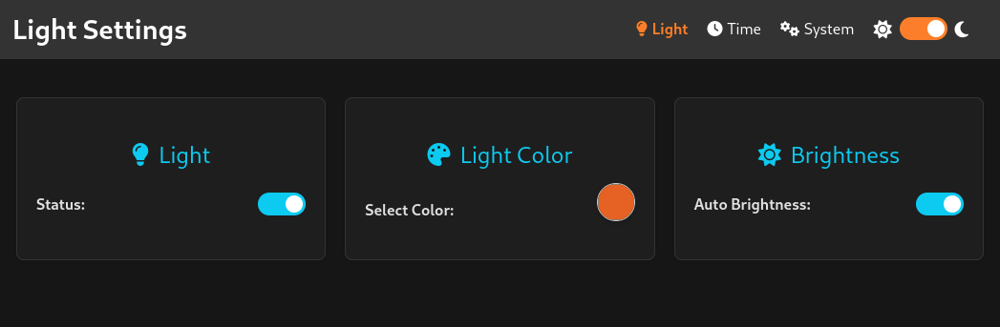

# Word-o-Clock

An ESP32-based word clock that displays time in natural language, with smart home integration and automatic brightness control.

## Key Features
- **Smart Word Clock** - Displays time in words using elegant LED matrix
- **Automatic Brightness** - Adapts to ambient light for optimal visibility
- **Smart Home Ready** - Native Home Assistant integration via MQTT
- **Easy Setup** - Web-based configuration and WiFi setup via access point
- **Flexible Display** - Custom colors, regional time formats, and scheduling

## Quick Start
1. Power up your Word-o-Clock using a USB-C power supply
2. Connect to the `word-o-Clock` WiFi network using the default password
3. Navigate to `192.168.4.1` in your browser
4. Enter your WiFi credentials
5. Follow the [first steps](https://wordoclock.testwiese.de/docs/quickstart/) 

## Documentation
Full documentation is available at [wordoclock.testwiese.de](https://wordoclock.testwiese.de):
- [Getting Started Guide](https://wordoclock.testwiese.de/docs/quickstart/)
- [Feature Documentation](https://wordoclock.testwiese.de/docs/features/)
- [Endpoint Reference](https://wordoclock.testwiese.de/docs/development/endpoints/)
- [German Clock Face](https://wordoclock.testwiese.de/docs/development/timeconverter-de/)

## Hardware Requirements
- ESP32 microcontroller
- WS2812B LED strip (120 LEDs)
- DS3231 RTC module
- Light sensor
- USB-C power supply (5V/2A recommended)

## Support
- Report issues on [GitHub](https://github.com/mplogas/word-oclock/issues)
- Check for [firmware updates](https://github.com/mplogas/word-oclock/releases)

## License
MIT License - see LICENSE file for details